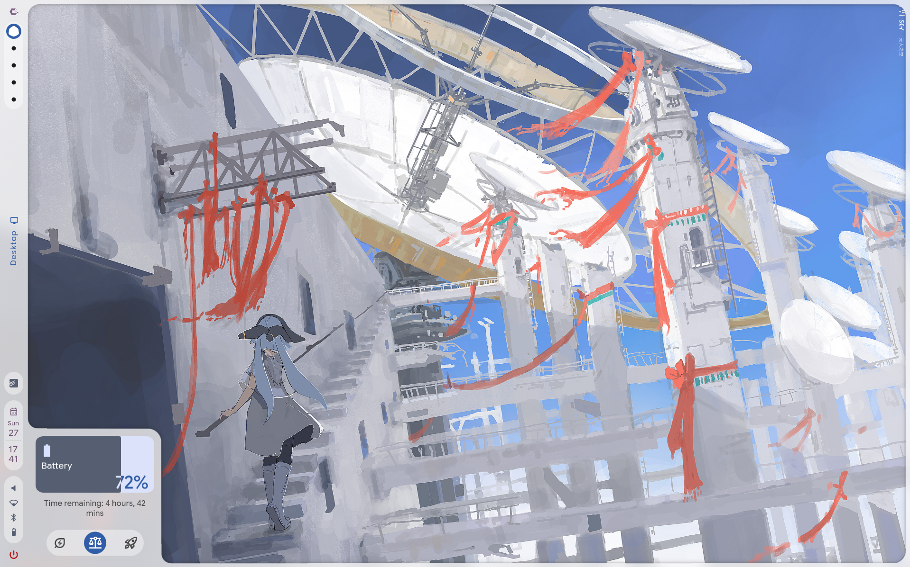
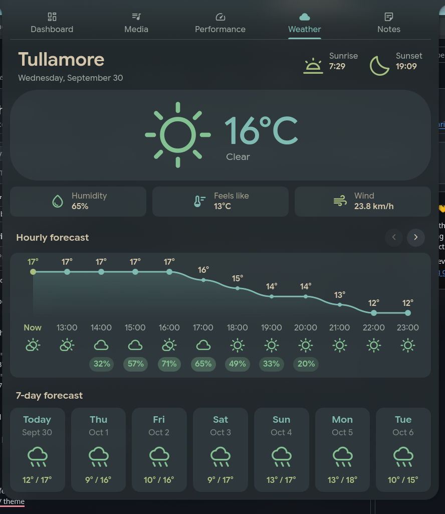

# Caelestia Dashboard Mods

Three additions for the [Caelestia](https://github.com/caelestia-dots/shell) dashboard:

- **Notes tab**: Notes that you can save to your dashboard
- **Hourly forecast** on the Weather tab: a temperature graph you scroll with arrows
- **Battery popout**: a fill gauge that turns green and animates while charging

## Screenshots:





## Install

```bash
git clone https://github.com/ItsXyzzy/Caelestia-Prefs
cd Caelestia-Prefs
./install.sh
```

Then restart the shell using:
```bash
caelestia shell -k
caelestia shell
```
It installs into `~/.config/quickshell/caelestia`, copying the system config there first if you don't have one.

## Uninstall

```bash
./uninstall.sh          # This keeps your notes
./uninstall.sh --purge  # This deletes them too
```

## Good to know

- The Weather and Battery files replace the stock ones. Originals are saved as `.bak`. If you've customised either, back it up first.
- Typing in Notes needs the dashboard to accept keyboard focus, so the installer adds one condition to `ContentWindow.qml`. The whole dashboard now grabs focus while open.
- Only tested on Cachy with Hyprland.

## Manual install

1. Copy the files in `qml/modules/` into `~/.config/quickshell/caelestia/modules/`.
2. In `modules/dashboard/Content.qml`, add a `Component { id: notesComponent; NotesTab {} }` next to the weather one, and this entry to the tab list:
   `{ component: notesComponent, iconName: "sticky_note_2", text: Tr.tr("Notes"), enabled: true }`
3. In `modules/drawers/ContentWindow.qml`, add `|| screenState.dashboard` to the `keyboardFocus` condition.

## License

GPL-3.0
